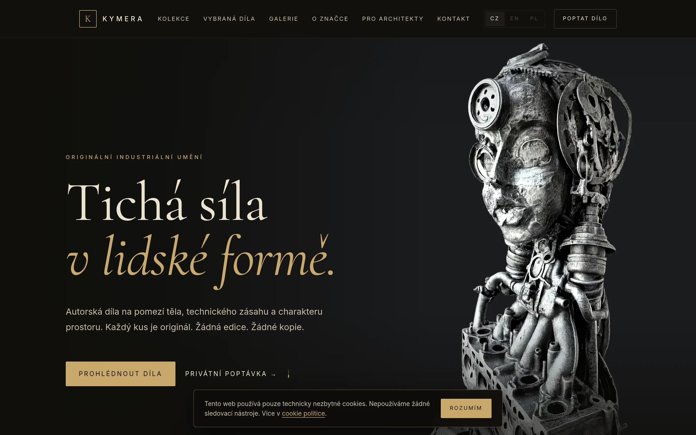
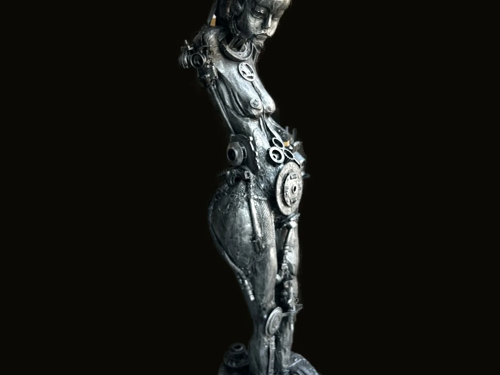
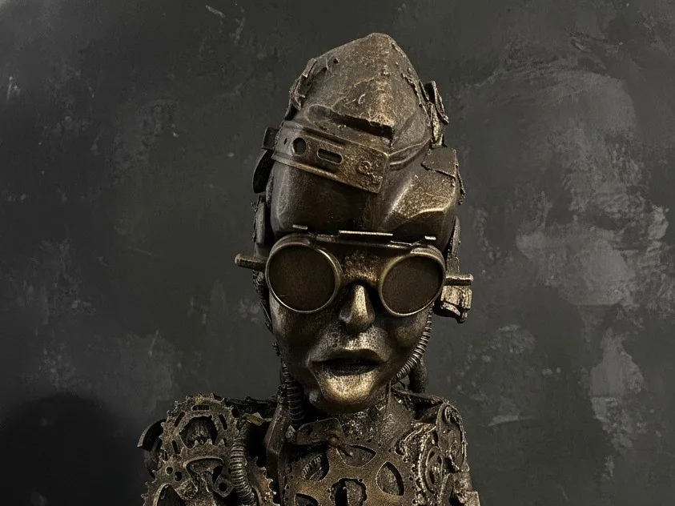
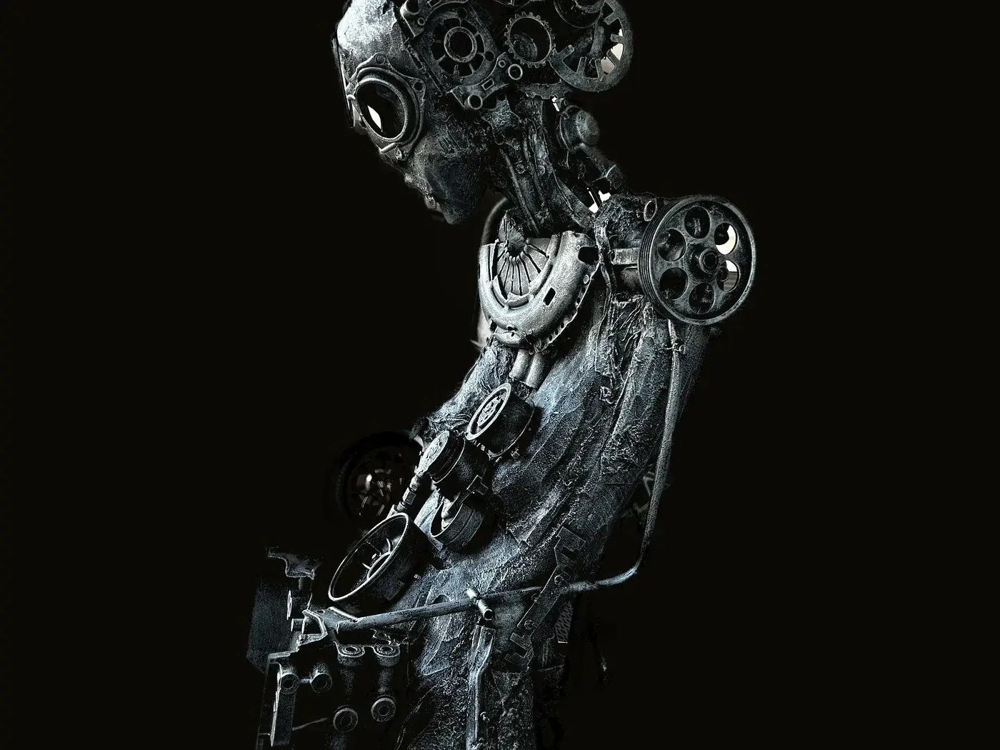

<div align="center">



<br><br>

<h1>KYMERA</h1>

<p><em>Lidská forma protkaná soukolím. Každé dílo originál.</em></p>

<br>

[](https://kymera-art.com)

<br>


<br>


</div>

<br>

---

## Obsah

| Sekce | Soubor | Popis |
|---|---|---|
| 🏠 Hlavní stránka | `index.html` | Celý web — hero, galerie, kontakt |
| 🎨 Styly | `style.css` | Hlavní stylesheet |
| ⚙️ Skripty | `script.js` | Menu, formulář, lightbox, cookies |
| 🔒 Security | `vercel.json` | CSP, HSTS, X-Frame-Options |
| ⚖️ GDPR | `legal/gdpr.html` | Zásady zpracování osobních údajů |
| 📄 Podmínky | `legal/podminky.html` | Obchodní podmínky |
| 🍪 Cookies | `legal/cookies.html` | Cookie politika |

---

## Struktura projektu

```
kymera/
├── index.html
├── style.css
├── script.js
├── vercel.json
├── robots.txt
├── sitemap.xml
├── legal/
│   ├── gdpr.html
│   ├── podminky.html
│   └── cookies.html
└── assets/
    ├── fonts/        ← Inter + Cormorant Garamond (lokální .woff2)
    ├── img/          ← hero · kolekce · díla · about (.webp, RGBA)
    └── galerie/      ← 12 děl pro lightbox (.webp)
```

---

## Díla

<div align="center">

| Figurální objekty | Hlavy a busty | Mechanické figury |
|:---:|:---:|:---:|
|  |  |  |

</div>

---

## Spuštění

```bash
# lokálně — žádný install, žádný build
python3 -m http.server 8080
```

**Jediné nastavení před ostrým provozem:**

```html
<!-- index.html — kontaktní formulář -->
<input type="hidden" name="access_key" value="YOUR_WEB3FORMS_ACCESS_KEY" />
```

→ Klíč na [web3forms.com](https://web3forms.com) · free tier stačí

---

## Deploy

```bash
git add .
git commit -m "..."
git push origin main   # → automatický deploy přes Vercel
```

> **Vercel nastavení:** Framework `Other` · Build Command prázdné · Output Directory prázdné

---

## Brand

<div align="center">

`#0c0b08` &nbsp;·&nbsp; `#15140f` &nbsp;·&nbsp; `#c8a96a` &nbsp;·&nbsp; Cormorant Garamond &nbsp;·&nbsp; Inter

</div>

---

<div align="center">

<sub>© 2026 Jakub Nowicki &nbsp;·&nbsp; KYMERA &nbsp;·&nbsp; Atelier Třinec, ČR</sub>

</div>
